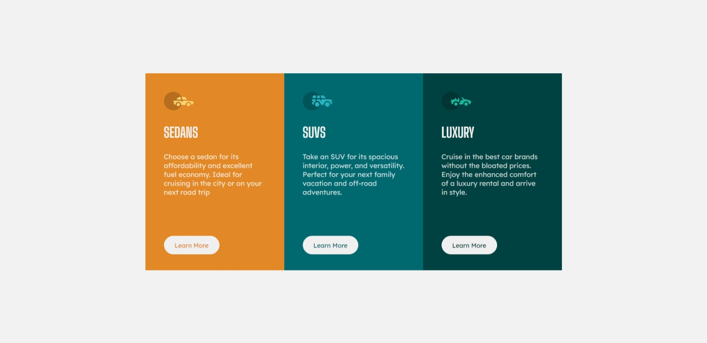

# Frontend Mentor - 3-column preview card component solution

This is a solution to the [3-column preview card component challenge on Frontend Mentor](https://www.frontendmentor.io/challenges/3column-preview-card-component-pH92eAR2-). Frontend Mentor challenges help you improve your coding skills by building realistic projects. 

## Table of contents

- [Overview](#overview)
  - [The challenge](#the-challenge)
  - [Screenshot](#screenshot)
  - [Links](#links)
- [My process](#my-process)
  - [Built with](#built-with)
  - [What I learned](#what-i-learned)
  - [Continued development](#continued-development)
- [Author](#author)


## Overview

### The challenge

Users should be able to:

- View the optimal layout depending on their device's screen size
- See hover states for interactive elements

### Screenshot




### Links

- Solution URL: [](https://chiwykes.github.io/3-Column-Preview-Component/)
[Solution](3-column-preview-card-component.html)


## My process

### Built with

- Semantic HTML5 markup
- CSS custom properties
- Flexbox


### What I learned

Understanding the use of flex box and hover state when designing the web page.

```css
button:hover {
  color: white;
  background-color: transparent;
}
```


### Continued development

I will continue to work and improve with projects allowing me to make use of flex box, grid and others.


## Author


- Frontend Mentor - [@chiwykes](https://www.frontendmentor.io/profile/chiwykes)


